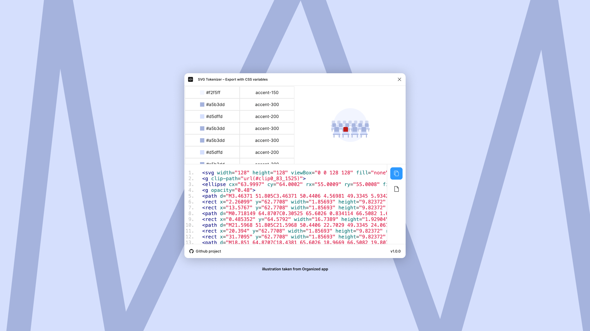

# SVG Tokenizer - Export with CSS variables

**SVG Tokenizer** is a Figma plugin that allows you to export SVGs with CSS variables for colors, making them more flexible and easier to manage in your projects.



## 🚀 Features

- Export SVGs with colors replaced by CSS variables
- Automatically generate a CSS file with variable definitions
- Customize variable names for better organization
- Optimized SVG output for web usage
- Preview before exporting
- Copy SVG to clipboard or save it as a file

## 🎯 Why Use It?

- Easily update colors globally using CSS variables
- Reduce redundancy in your SVG styles
- Improve theming support for web applications

## 📌 How to Use

1. Select the element in Figma that you want to export.
2. Open the plugin.
3. Review the colors that will be exported.
4. If a color variable is not found, update the color in Figma and restart the plugin.
5. To locate an object within the element, simply click on the color.
6. Export the SVG with CSS variables:
   - Save as a file
   - Or copy to the clipboard


## 💡 Credits  
Special thanks to [**Vlad (@ux-git)**](https://github.com/ux-git) for the idea!  


## 🔗 Get Started

Install the plugin from the [Figma Community](https://www.figma.com/community/plugin/1469432927974614656/svg-tokenizer-export-with-css-variables) and streamline your SVG workflow today!


## Developerment

### Setup env
```bash
# Install dependencies for the plugin directory
npm install

# Install dependencies for the compositor
cd ./compositor
npm install
```

### Developerment

```bash
# To assemble the UI (HTML, CSS, ui.js) into one file, use compositor
cd ./compositor
npm run composite

# To convert ui.ts to ui.js, use the following command
# Work in the project directory (not in compositor)
npm run cui 

# To assemble the Plugin (Backend) side, use the following commands:
npm run watch
npx webpack
```
